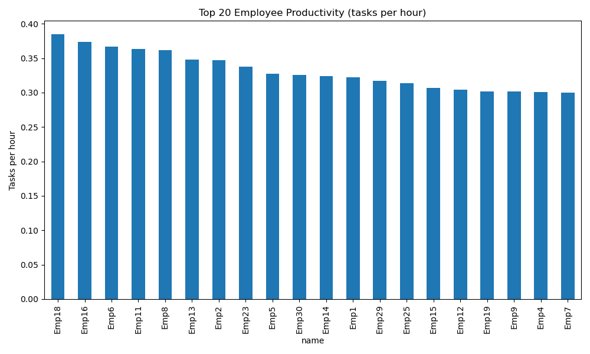

# 📊 Employee KPI Analysis with Python & SQLite

This project demonstrates **end-to-end data analysis skills** using **SQL (SQLite)** for database management and **Python (pandas, matplotlib, SQLAlchemy)** for analysis and visualization.  
It also includes a **Streamlit dashboard** for interactive exploration.

---

## 🚀 Project Overview

- **Database:** SQLite (lightweight, portable, widely used for demos)
- **Schema:**
  - `employees` (30 employees across 5 departments)
  - `kpi` (360 monthly KPI records: 12 months × 30 employees)
- **Tech stack:**
  - SQL for schema design and queries
  - Python (pandas, matplotlib, SQLAlchemy) for data analysis & plots
  - Streamlit for dashboard visualization
- **Deliverables:**
  - Ready-to-use SQLite database (`employee_kpi.db`)
  - Python analysis script (`analysis.py`)
  - Interactive dashboard (`dashboard.py`)
  - Reproducible setup steps

---

## 📂 Project Structure

```
employee-kpi-analysis/
│── init_db.sql          # Schema + 30 employees + 360 KPI rows
│── employee_kpi.db      # Generated SQLite database (after running init_db.sql)
│── analysis.py          # Python analysis script (CSV + plots)
│── dashboard.py         # Streamlit dashboard (interactive)
│── outputs/             # Generated CSVs & PNGs
│── README.md            # Project documentation
```

---

## ⚙️ Setup Instructions

### 1. Install SQLite (Ubuntu)
```bash
sudo apt update
sudo apt install -y sqlite3
sqlite3 --version
```

### 2. Setup Conda Environment
```bash
conda create -n kpi_env python=3.10 -y
conda activate kpi_env
conda install pandas matplotlib sqlalchemy -y
conda install -c conda-forge streamlit -y   # optional, for dashboard
```

### 3. Create Database from SQL File
```bash
sqlite3 employee_kpi.db < init_db.sql
```

Verify:
```bash
sqlite3 employee_kpi.db "SELECT COUNT(*) FROM employees;"   # should be 30
sqlite3 employee_kpi.db "SELECT COUNT(*) FROM kpi;"         # should be 360
```

### 4. Run Python Analysis
```bash
python analysis.py
```

This will generate:
- `outputs/avg_kpi_by_department.csv`
- `outputs/top_csat.csv`
- `outputs/productivity.csv`
- `outputs/productivity.png`
- `outputs/avg_kpi_by_department.png`

### 5. Run Streamlit Dashboard (Optional)
```bash
streamlit run dashboard.py
```
Open in browser: **http://localhost:8501**

---

## 🗄️ Database Schema

```sql
CREATE TABLE employees (
    emp_id INTEGER PRIMARY KEY,
    name TEXT NOT NULL,
    department TEXT NOT NULL,
    hire_date DATE NOT NULL
);

CREATE TABLE kpi (
    kpi_id INTEGER PRIMARY KEY AUTOINCREMENT,
    emp_id INTEGER NOT NULL,
    review_date DATE NOT NULL,
    sales INTEGER,
    customer_satisfaction REAL,
    tasks_completed INTEGER,
    hours_worked REAL,
    FOREIGN KEY (emp_id) REFERENCES employees(emp_id)
);
```

---

## 📊 Example Analysis

### SQL Queries

**Employees per department:**
```sql
SELECT department, COUNT(*) 
FROM employees 
GROUP BY department;
```

**Top 5 productive employees:**
```sql
SELECT e.name,
       ROUND(SUM(k.tasks_completed)*1.0 / SUM(k.hours_worked), 2) AS productivity
FROM employees e
JOIN kpi k ON e.emp_id = k.emp_id
GROUP BY e.emp_id
ORDER BY productivity DESC
LIMIT 5;
```

### Python Insights

- **Average KPI by Department:** Aggregated mean values for sales, satisfaction, and tasks.
- **Top Employees by Customer Satisfaction:** Sorted top 10 employees.
- **Productivity (tasks/hour):** Ranking employees by efficiency.

Example plot (auto-generated):

📌 *Productivity (Tasks per Hour)*  


---

## 📈 Dashboard Features (Streamlit)

- Department filter (All / Sales / Engineering / HR / Marketing / Finance)
- Average KPI by department (bar chart + table)
- Top 10 employees by satisfaction
- Productivity ranking (tasks/hour)

---

## 💡 Key Learnings & Skills Demonstrated

- **SQL (DDL & DML):** Schema creation, foreign keys, data inserts, aggregate queries.
- **Python Data Analysis:** pandas merging, groupby, aggregation, visualization.
- **Visualization:** matplotlib plots and interactive Streamlit dashboard.
- **Reproducibility:** Single SQL file (`init_db.sql`) makes project easy to set up.
- **Version Control Ready:** Can be pushed to GitHub as a portfolio project.

---

## 📌 Next Steps / Possible Improvements

- Replace synthetic data with real-world KPI dataset.
- Add more advanced KPIs (e.g., revenue per employee, churn rate).
- Deploy Streamlit dashboard online (e.g., Streamlit Cloud or Heroku).
- Containerize with Docker for portability.

---

## 👨‍💻 Author

Developed as a demonstration project to showcase **data analysis, SQL, and Python visualization skills**.  
Feel free to fork, explore, and adapt!

